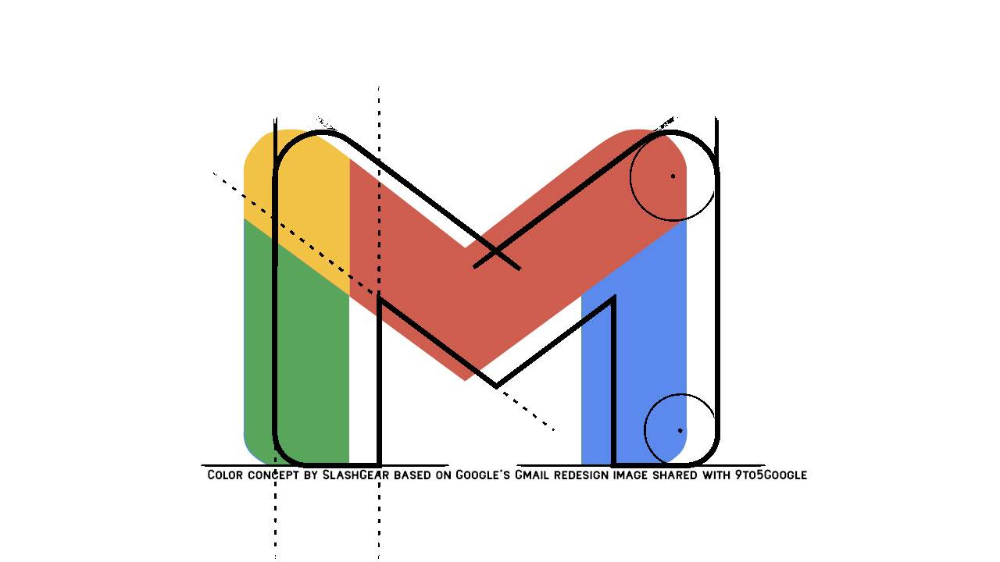

# John Baxter
### Software Developer, London | Scotland

  

  

[Projects](#projects) /
[Skills](#skills) /
[Education](#education) / 
[Experience](#experience) / 
[Volunteering](#voluntary-positions) / 
[Hobbies](#hobbies)

***
I am a junior software developer and graduate of 
[Makers Academy](#education).\
My background combines the hard-working logical thoroughness of working in 
[pharmaceutical research](#experience) 
with experience of customer service and working to client demands.

I'm looking for a back-end focussed role where I can continue to develop my technical ability and the problem-solving and teamworking skills that I used during the bootcamp.

I'm very excited about how the world of tech has created so many new ways to improve the lives of people all around the world. From large-scale ecological projects benefiting the natural world to the fact that banking is now a bit easier; real people are seeing real advantages based on the work of developers everywhere.

During the Makers bootcamp; the coursework focussed mainly on Ruby, JavaScript and SQL languages. I have continued to learn Python and PHP to continue my professional development.

***
## [^](#john-baxter)Projects
|Project|Description|Language|Testing&nbsp;&nbsp;&nbsp;&nbsp;&nbsp;&nbsp;&nbsp;&nbsp;&nbsp;&nbsp;&nbsp;&nbsp;&nbsp;&nbsp;&nbsp;&nbsp;&nbsp;&nbsp;&nbsp;|Techniques&nbsp;&nbsp;&nbsp;&nbsp;&nbsp;&nbsp;&nbsp;&nbsp;&nbsp;&nbsp;&nbsp;&nbsp;&nbsp;&nbsp;&nbsp;&nbsp;|
|:---|:---|:---|:---|:---|
|[Bites game][bites-gh]|A playable clone of the existing tabletop game ['Bites'][bites-bgt]. Playable through the command line and copies the logic used in the game in a clean test-driven Python app. |Python|Python's built-in testing framework: [unittest][python-unittest].|Test-driven development (TDD), single responsibility principle (SRP) and object-oriented programming (OOP).|
|[Deep Sea Adventure game][deep-sea-adventure-gh]|A playable clone of the existing tabletop game ['Deep Sea Adventure'][deep-sea-adventure-oink] Playable through the command line and copies the logic used in the game. Uses lessons learned during the Bites project.|Python|Python's built-in testing framework: [unittest][python-unittest].|Learning from previous experience. Refining skills in TDD, SRP and OOP.|
|[Project Euler][project-euler-gh]|My work on the popular web-based series of mathematical/coding challenges; [Project Euler][project-euler]. Each challenge has its own README explaining how it was approached.|Python|Not test-driven; any testing was done by 'feature tests' and visually inspecting practice outputs.|Planning my work, problem solving, reporting progress. Memoisation. Code reviewing.|
|[Makers Algorithm Workshop][algorithm-workshop-gh]|My work on the Algorithmic Complexity workshop run by Makers Academy post-bootcamp. Where I developed a basic understanding of algorithmic time complexity and how to think about optimising my code.|Ruby|Not test-driven; any testing was done by 'feature tests' and visually inspecting practice outputs.|OOP, optimisation and recursion. Basic understanding of big-O classification.|
|[Operation Green Grid][green-grid-gh]|Something I made for my own amusement. A 'commit-bot' which, if left running, will push commits to my GitHub account at random intervals.|Python|Not test-driven; any testing was done by 'feature tests' and visually inspecting practice outputs.|Sending instructions to the command line, spiking, and ad-hoc learning during code production.|

***
## [^](#john-baxter)Skills
### **Attention to detail**
In my previous role as a lab technician, one of my responsibilities was to proof-read technical documents relating to testing of samples. This took the form of homogenising the tone and language style of documents that may have been written over extended periods of time by several individuals; and conceptualising what was actually being asked for to make sure that there was some degree of flow and that instructions were in a sensible order. 
This has influenced my decision to change career, as this is a very useful skill to have as a software developer. Understanding how small steps flow together helps with building complex algorithms from small functions, and being able to spot small discrepancies in language use is great for debugging code.

- Developed a reputation for being the main reliable person to do this task.
- Made lab testing more efficient and straightforward for several projects; including on behalf of teams I was not a member of.

### **Fast learner**
Learning quickly is something that has helped me throughout my life. Working on multiple projects in various labs requires getting to grips with different lab equipment on a regular basis; and it is fairly typical for different clients and colleagues to have subtly different styles and requirements. 
Fast learning is best illustrated by how I was able to successfully navigate the coding bootcamp from a starting point of having no knowledge or understanding at all, and ending less than one year later in a position where I am managing my own projects and able to successfully try out new languages.
Also in my leisure time: board games and video games both must be understood pretty well if I'm to avoid coming in last place.

- While working at Cambridge consultants, I was the resident expert for using the 
[force testing equipment][mecmesin], 
a position I developed rapidly after it featured prominently in the first project I was involved in.
- I have demonstrated my ability to learn quickly throughout my academic career. Understanding the complicated concepts involved in chemistry when each module only lasts for two months; and getting to grips with the nuances of a programming language I've never heard of in preparation to attend the bootcamp.
- Some evidence of how my coding has progressed over time can be seen in my 
[codewars profile][codewars-killie-skank]
and the 
[GitHub&nbsp;repository][project-euler-gh]
containing the work I've done on Project Euler.

### **Teamworking**
I find working in well organised teams very fulfilling. It is a very satisfying feeling to have worked together to complete a task that would have been impossible for any of the individuals to have done alone. 
This is something that I experienced in the multi-disciplinary teams I was a member of while working at Cambridge Consultants, while I was studying and even as a member of sports teams. I used these experiences to my advantage by succesfully pair programming on projects throughout the bootcamp; a practise which was new to me at the time.

- Added my experience of working in a lab to project teams including physicists, software developers and mechanical engineers.
- Worked in a team that succesfully developed a novel [neuromodulation device][neuromodulation-wiki] from design concept to market release with very strict deadlines imposed by Health Canada
- Achieved distinction in group projects in subjects including chemistry and marketing.

***
## [^](#john-baxter)Education
### [Makers Academy][makers], software bootcamp (January 2020 to Present)
**Graduated from a leading London software bootcamp**\
Decided to pursue a career change
- Intensive self-led learning environment.
- Learned the programming practises of TDD, OOP and MVC and Agile development.
- Developed and refined skills in problem solving, pair programming and working on team projects.
- Pair programming variously in-person and remote, team projects exclusively remote.
- Utilised & improved interpersonal and team-working skills learned in previous roles.
- Disciplined and committed to working under the pressures of upcoming project deadlines.
- Realised the benefits and overcame the difficulty of mixing different working styles.

Programing languages covered: Ruby - including Rails, JavaScript, Python, SQL & PHP

### [Heriot-Watt University, Edinburgh][hw-ac-uk]
**BSc Chemistry with Management**\
Final project was in inorganic chemistry - specifically organometallic chemistry
- Modules included chemistry as the main subject with supplementary mathematics, and electives in economics, marketing, business modelling and project management.
- Learning how to work under pressure and to tight deadlines.
- Learning self-discipline and team working skills.

***
## [^](#john-baxter)Experience
### [Cambridge Consultants][cambridge-consultants], engineering consultancy (2012 to 2019)
**Laboratory Technician**\
Worked within project teams to develop novel medical devices, encompassing the process from initial concept to commercial release.
- Used time management efficiently to meet tight deadlines for multiple simultaneous projects, and adapt procedures to accommodate changing requirements.
- Required to analyse multiple different data points and test for discrepancies, using attention to detail.
- Effectively used communication skills to communicate with multi-disciplinary teams to ensure work was progressing.
- Displayed flexibility and adaptability to contend with any changes to project scope or deadlines.
- Assumed ad-hoc leadership of sub-teams when necessary to make sure team members were working cooperatively.

### Melbourn Scientific, now part of [Intertek][intertek-melbourn] (2009 to 2012)
**Laboratory Analyst**
- Ensured that our workspaces and procedures were compliant with the requirements of upcoming audits. The testing I did was aligned with the guidelines set by the United States and European Pharmacopoeias.
- Testing samples by a variety of industry-standard quantitative, and various qualitative techniques.
- Was able to multi-task to maintain optimal workflow.
- Able to adapt behaviour, working practises and communication to mesh well with different colleagues.
- Able to manage my own time and productivity to optimise the throughput of test samples.

***
## [^](#john-baxter)Voluntary positions
### [RSPB Grange Farm][rspb-grange-farm] (October to November 2009)
**Laboratory Assistant**
- Supported an ongoing conservation project in alignment with my passion for supporting wildlife.
- Prepared samples for analysis; samples contained assorted invertebrates which were to be catalogued by order.
- The role required attention to detail and self-motivation.

### [Edinburgh Zoo (Education Department)][ed-zoo] (2008 to 2009)
**Volunteer helper**
- Supported the zoo’s education program in alignment with my desire to support both conservation and education.
- Engaged with members of the public and provided interactive educational experiences.
- The role provided opportunities to learn about various animals and to present this information to zoo visitors.

***
## [^](#john-baxter)Hobbies
I like to contrast my busy tech work-life with stepping away from the screen and keyboard in my leisure time. A lot of what I do for fun could be described as traditional or old-fashioned. I also enjoy learning lots of information about a diverse range of subjects, so when something interests me I am likely to find something to read about it.
- Cooking is a nice activity to help wind down at the end of a busy day. I enjoy taking my time over the process, and experimenting with flavours. Eating delicious food at the end is also a bonus - and if something hasn't worked out, well that's what Tabasco is for. 
- Watching lower league (and non-league) football is a fun passtime for a Saturday afternoon. Going to a small stadium and getting involved with the local community is what I consider 'real' football. It's nice to be far removed from the TV cameras and million-pound advertising contracts.
- Learning languages is a good way to keep the brain active; so alongside Ruby, Python et al. I can also say: \
He estado aprendiendo español desde hace tres años.
- Practicing circus skills like juggling or whip-cracking is a physical passtime best enjoyed in a field with friends. I regularly attend an organised event in Warwickshire where I can learn how to balance objects on my chin, and even try things like archery. It's also a great way to meet loads of interesting people.

[email me](mailto:john.g.baxter@googlemail.com?subject=[GitHubCV])

[algorithm-workshop-gh]: <https://github.com/john-baxter/makers-algorithm-workshop>
[bites-gh]: <https://github.com/john-baxter/Bites-game>
[deep-sea-adventure-gh]: <https://github.com/john-baxter/deep-sea-adventure>
[green-grid-gh]: <https://github.com/john-baxter/operation-green-grid>
[project-euler-gh]: <https://github.com/john-baxter/project-euler>

[bites-bgt]: <https://www.boardgametables.com/products/bites-board-game>
[deep-sea-adventure-oink]: <https://oinkgames.com/en/games/analog/deep-sea-adventure/>
[project-euler]: <https://projecteuler.net/about>
[python-unittest]: <https://docs.python.org/3/library/unittest.html>

[makers]: <www.makers.tech>
[hw-ac-uk]: <https://www.hw.ac.uk/uk/edinburgh.htm>
[cambridge-consultants]: <https://www.cambridgeconsultants.com/about-us>
[intertek-melbourn]: <https://www.intertek.com/pharmaceutical/melbourn/>
[rspb-grange-farm]: <https://www.rspb.org.uk/our-work/conservation/conservation-and-sustainability/farming/hope-farm/the-farm/>
[ed-zoo]: <https://www.edinburghzoo.org.uk/education/>
[mecmesin]: <https://www.mecmesin.com/>
[codewars-killie-skank]: <https://www.codewars.com/users/killie_skank/completed_solutions>
[neuromodulation-wiki]: <https://en.wikipedia.org/wiki/Neuromodulation_(medicine)>
